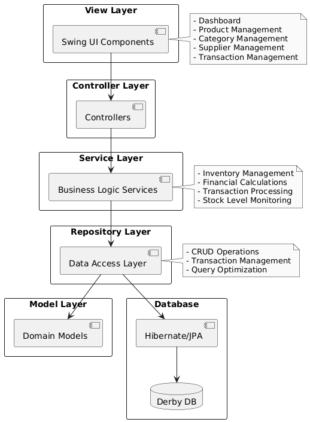

<!-- Improved compatibility of back to top link: See: https://github.com/othneildrew/Best-README-Template/pull/73 -->

<a id="readme-top"></a>

<!--
*** Thanks for checking out the Best-README-Template. If you have a suggestion
*** that would make this better, please fork the repo and create a pull request
*** or simply open an issue with the tag "enhancement".
*** Don't forget to give the project a star!
*** Thanks again! Now go create something AMAZING! :D
-->

<!-- PROJECT SHIELDS -->
<!--
*** I'm using markdown "reference style" links for readability.
*** Reference links are enclosed in brackets [ ] instead of parentheses ( ).
*** See the bottom of this document for the declaration of the reference variables
*** for contributors-url, forks-url, etc. This is an optional, concise syntax you may use.
*** https://www.markdownguide.org/basic-syntax/#reference-style-links
-->

[![Forks][forks-shield]][forks-url]
[![Stargazers][stars-shield]][stars-url]
[![Issues][issues-shield]][issues-url]
[![MIT License][license-shield]][license-url]
[![LinkedIn][linkedin-shield]][linkedin-url]

<!-- PROJECT LOGO -->
<br />
<div align="center">
  <a href="https://github.com/realYushi/Inventory-Management-System">
    
  </a>

  <h3 align="center">Inventory Management System</h3>

  <p align="center">
    An advanced tool designed to simplify the complexities of inventory management.
    <br />
    <a href="https://github.com/realYushi/Inventory-Management-System"><strong>Explore the docs »</strong></a>
    <br />
    <br />
    <a href="https://github.com/realYushi/Inventory-Management-System">View Demo</a>
    ·
    <a href="https://github.com/realYushi/Inventory-Management-System/issues/new?labels=bug&template=bug-report---.md">Report Bug</a>
    ·
    <a href="https://github.com/realYushi/Inventory-Management-System/issues/new?labels=enhancement&template=feature-request---.md">Request Feature</a>
  </p>
</div>

<!-- TABLE OF CONTENTS -->
<details>
  <summary>Table of Contents</summary>
  <ol>
    <li>
      <a href="#about-the-project">About The Project</a>
      <ul>
        <li><a href="#key-features">Key Features</a></li>
        <li><a href="#screenshots">Screenshots</a></li>
        <li><a href="#architecture">Architecture</a></li>
        <li><a href="#built-with">Built With</a></li>
      </ul>
    </li>
    <li>
      <a href="#getting-started">Getting Started</a>
      <ul>
        <li><a href="#prerequisites">Prerequisites</a></li>
        <li><a href="#installation">Installation</a></li>
      </ul>
    </li>
    <li><a href="#project-structure">Project Structure</a></li>
    <li><a href="#license">License</a></li>
    <li><a href="#contact">Contact</a></li>
    <li><a href="#acknowledgments">Acknowledgments</a></li>
  </ol>
</details>

<!-- ABOUT THE PROJECT -->

## About The Project

The **Inventory Management System** is a desktop application crafted to streamline inventory management for small to medium-sized businesses. It features a user-friendly interface designed to simplify the tracking and organization of products, categories, suppliers, and inventory transactions, all while providing key insights for effective decision-making.

### Key Features

- **Dashboard Overview**

  - Comprehensive financial summary, including real-time sales, costs, and profit insights
  - Alerts for low stock levels
  - Quick access to recent transactions for up-to-date monitoring

- **Product Management**

  - Full suite of CRUD (Create, Read, Update, Delete) operations
  - Seamless product association with categories and suppliers
  - Real-time stock level monitoring
  - Easy tracking of units, pricing, and product details

- **Category Management**

  - Efficient product categorization and organization
  - Management of category-supplier relationships
  - Reporting and insights based on product categories

- **Supplier Management**

  - Centralized supplier information management
  - Tracking of supplier-product relationships
  - Integrated contact management for streamlined communication

- **Inventory Transactions**
  - Sales tracking with revenue insights
  - Purchase management with cost monitoring
  - Spoilage tracking for accurate inventory maintenance

### Screenshots

#### Dashboard View


Monitor your business metrics at a glance with our intuitive dashboard.

#### Product Management


Efficiently manage your product inventory with detailed tracking.

#### Category Management


Organize products into categories for better inventory control.

#### Supplier Management


Keep track of your suppliers and their associated products.

#### Transaction Management


Record and track all inventory movements with ease.

### Architecture



The application follows a layered architecture:

- **View Layer**: Swing-based user interface components providing intuitive interaction
- **Controller Layer**: Handles user input and coordinates between View and Service layers
- **Service Layer**: Implements core business logic and transaction management
- **Repository Layer**: Manages data access and persistence using Hibernate/JPA
- **Model Layer**: Contains domain entities and business rules
- **Database Layer**: Apache Derby database for reliable data storage

#### View Layer (UI)

- Swing-based user interface components
- Responsive panel layouts
- User input handling
- Real-time updates

#### Controller Layer

- User input processing
- View-Service coordination
- Input validation
- Error handling

#### Service Layer

- Business logic implementation
- Transaction management
- Data validation
- Cross-cutting concerns

#### Repository Layer

- Data access interfaces
- Hibernate/JPA implementation
- Transaction handling
- Query optimization

#### Model Layer

- Entity classes with JPA annotations
- Business logic validation
- Relationship mappings
- Data integrity rules

### Built With

- Java 11
- Swing (UI Framework)
- Hibernate/JPA (Persistence)
- Apache Derby (Database)
- Maven (Build Tool)
- JUnit & Mockito (Testing)

## Getting Started

### Prerequisites

- Java JDK 11 or higher
- Maven 3.6 or higher
- Apache Derby Database

### Installation

1. Clone the repository

   ```bash
   git clone https://github.com/realYushi/Inventory-Management-System.git
   ```

2. Navigate to project directory

   ```bash
   cd Inventory-Management-System
   ```

3. Build the project

   ```bash
   mvn clean install
   ```

4. Run the application

   ```bash
   java -jar target/inventoryManagementSystem-0.1.jar
   ```

## Project Structure

```plaintext
src/
└── main/
    ├── java/me/yushi/inventorymanagementsystem/
    │   ├── controller/ # UI Controllers
    │   ├── model/ # Entity Classes
    │   ├── repository/ # Data Access Layer
    │   ├── service/ # Business Logic
    │   └── view/ # Swing UI Components
    └── resources/
        └── META-INF/
            └── persistence.xml # JPA Configuration
```

## License

Distributed under the MIT License. See `LICENSE.txt` for more information.

## Contact

Yushi Cui - realYushi@gmail.com

Project Link: [https://github.com/realYushi/Inventory-Management-System](https://github.com/realYushi/Inventory-Management-System)

## Acknowledgments

- [Hibernate](https://hibernate.org/)
- [Apache Derby](https://db.apache.org/derby/)
- [Maven](https://maven.apache.org/)
- [JUnit](https://junit.org/)
- [Mockito](https://site.mockito.org/)

<p align="right">(<a href="#readme-top">back to top</a>)</p>

<!-- MARKDOWN LINKS & IMAGES -->
<!-- https://www.markdownguide.org/basic-syntax/#reference-style-links -->

[contributors-shield]: https://img.shields.io/github/contributors/realYushi/Inventory-Management-System.svg?style=for-the-badge
[contributors-url]: https://github.com/realYushi/Inventory-Management-System/graphs/contributors
[forks-shield]: https://img.shields.io/github/forks/realYushi/Inventory-Management-System.svg?style=for-the-badge
[forks-url]: https://github.com/realYushi/Inventory-Management-System/network/members
[stars-shield]: https://img.shields.io/github/stars/realYushi/Inventory-Management-System.svg?style=for-the-badge
[stars-url]: https://github.com/realYushi/Inventory-Management-System/stargazers
[issues-shield]: https://img.shields.io/github/issues/realYushi/Inventory-Management-System.svg?style=for-the-badge
[issues-url]: https://github.com/realYushi/Inventory-Management-System/issues
[license-shield]: https://img.shields.io/github/license/realYushi/Inventory-Management-System.svg?style=for-the-badge
[license-url]: https://github.com/realYushi/Inventory-Management-System/blob/master/LICENSE.txt
[linkedin-shield]: https://img.shields.io/badge/-LinkedIn-black.svg?style=for-the-badge&logo=linkedin&colorB=555
[linkedin-url]: https://www.linkedin.com/in/yushi-cui-6043aa285/
