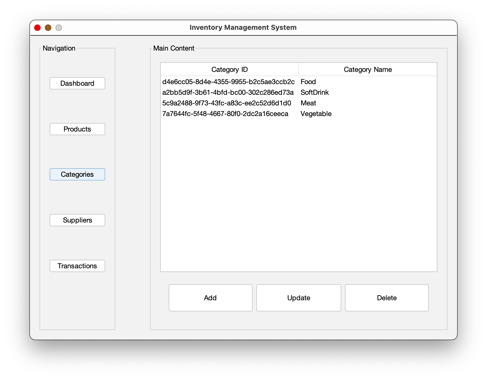
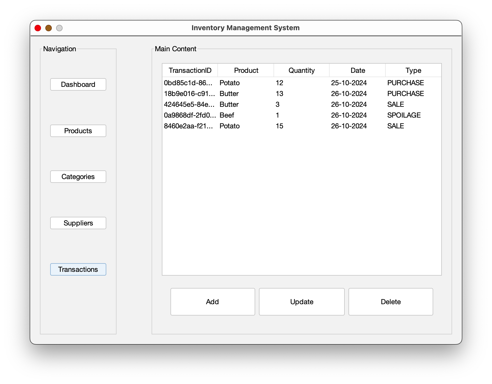

<!-- Improved compatibility of back to top link: See: https://github.com/othneildrew/Best-README-Template/pull/73 -->

<a id="readme-top"></a>

<!--
*** Thanks for checking out the Best-README-Template. If you have a suggestion
*** that would make this better, please fork the repo and create a pull request
*** or simply open an issue with the tag "enhancement".
*** Don't forget to give the project a star!
*** Thanks again! Now go create something AMAZING! :D
-->

<!-- PROJECT SHIELDS -->
<!--
*** I'm using markdown "reference style" links for readability.
*** Reference links are enclosed in brackets [ ] instead of parentheses ( ).
*** See the bottom of this document for the declaration of the reference variables
*** for contributors-url, forks-url, etc. This is an optional, concise syntax you may use.
*** https://www.markdownguide.org/basic-syntax/#reference-style-links
-->

[![Forks][forks-shield]][forks-url]
[![Stargazers][stars-shield]][stars-url]
[![Issues][issues-shield]][issues-url]
[![MIT License][license-shield]][license-url]
[![LinkedIn][linkedin-shield]][linkedin-url]

<!-- PROJECT LOGO -->
<br />
<div align="center">
  <a href="https://github.com/realYushi/Inventory-Management-System">
    
  </a>

<h3 align="center">Inventory Management System</h3>

  <p align="center">
    An advanced tool designed to simplify the complexities of inventory management.
    <br />
    <a href="https://github.com/realYushi/Inventory-Management-System"><strong>Explore the docs »</strong></a>
    <br />
    <br />
    <a href="https://github.com/realYushi/Inventory-Management-System">View Demo</a>
    ·
    <a href="https://github.com/realYushi/Inventory-Management-System/issues/new?labels=bug&template=bug-report---.md">Report Bug</a>
    ·
    <a href="https://github.com/realYushi/Inventory-Management-System/issues/new?labels=enhancement&template=feature-request---.md">Request Feature</a>
  </p>
</div>

<!-- TABLE OF CONTENTS -->
<details>
  <summary>Table of Contents</summary>
  <ol>
    <li>
      <a href="#about-the-project">About The Project</a>
      <ul>
        <li><a href="#built-with">Built With</a></li>
        <li><a href="#architecture">Architecture</a></li>
      </ul>
    </li>
    <li>
      <a href="#getting-started">Getting Started</a>
      <ul>
        <li><a href="#prerequisites">Prerequisites</a></li>
        <li><a href="#installation">Installation</a></li>
      </ul>
    </li>
    <li><a href="#usage">Usage</a></li>
    <li><a href="#roadmap">Roadmap</a></li>
    <li><a href="#license">License</a></li>
    <li><a href="#contact">Contact</a></li>
    <li><a href="#acknowledgments">Acknowledgments</a></li>
  </ol>
</details>

<!-- ABOUT THE PROJECT -->

https://github.com/user-attachments/assets/3d6fc573-3c93-4331-8179-b140dcfbc6c0

## About The Project

The Inventory Management System is a personal project developed to handle the intricacies of managing inventory across various categories and suppliers. It offers a detailed and intuitive interface for monitoring product details, transactions, and stock levels, ensuring that inventory management is both efficient and straightforward.

This system is particularly useful for small to medium-sized business owners looking to digitize their inventory processes and enhance operational efficiency.

### Architecture

Architecture Overview:

The project follows a layered architecture with clear separation of concerns:

- **Model**: Represents the data structures (e.g., Product, Category, Supplier, InventoryTransaction)
- **Repository**: Handles data persistence and retrieval (e.g., ProductRepository, CategoryRepository)
- **Service**: Contains business logic (e.g., ProductService, CategoryService)
- **Controller**: Acts as an intermediary between the View and Service layers (e.g., ProductController, CategoryController)
- **View**: Handles user interface and interaction (e.g., ProductView, CategoryView)

Design Patterns:

- Utilizes the Unit of Work pattern for managing database transactions
- Implements the Builder pattern for creating DTOs
- Uses the Repository pattern for data access abstraction

Key Features:

- CRUD operations for Products, Categories, Suppliers, and Inventory Transactions
- Text-based user interface using Lanterna library
- File-based data persistence using JSON
- Modular and extensible design

Core Components:

- **FileHandler**: Generic JSON file read/write operations
- **UnitOfWork**: Coordinating work across multiple repositories
- **APP**: Main application entry point and navigation
- **DashboardService**: Providing summary data for the dashboard

Data Flow:

1. User interacts with View
2. View calls Controller methods
3. Controller uses Service layer for business logic
4. Service layer interacts with Repository for data access
5. Repository uses FileHandler for data persistence
6. Results propagate back up the chain to the View

<p align="right">(<a href="#readme-top">back to top</a>)</p>

### Built With

- [Java](https://java.com)
- [Maven](https://maven.apache.org/)
- [Lanterna](https://github.com/mabe02/lanterna)
- [Gson](https://github.com/google/gson)

<p align="right">(<a href="#readme-top">back to top</a>)</p>

<!-- GETTING STARTED -->

## Getting Started

To get a local copy up and running follow these simple steps.

### Prerequisites

This project uses Maven to manage dependencies. Ensure Maven is installed:

```sh
mvn -v
```

### Installation

1. Clone the repo
   ```sh
   git clone https://github.com/realYushi/Inventory-Management-System.git
   ```
2. Install Maven dependencies
   ```sh
   mvn install
   ```
3. Run the application
   ```sh
   java -jar target/inventoryManagementSystem-0.1.jar
   ```

<p align="right">(<a href="#readme-top">back to top</a>)</p>

<!-- USAGE EXAMPLES -->

## Usage

This Inventory Management System offers a comprehensive suite of features designed to manage and monitor inventory effectively for small to medium-sized businesses. Here's how you can utilize the system:

### Dashboard


- **Financial Overview**: View a summary of total sales, costs, net profit, and gross margin percentage.
- **Inventory Alerts**: Receive notifications for low stock levels to ensure you never run out of key products.

### Product Management


- **Manage Products**: Add, update, delete, and view products with details such as ID, name, category, quantity, unit, and price.

### Category Management



- **Manage Categories**: Create, update, delete, and view categories. Each category can be associated with a specific supplier, helping to organize inventory better.

### Supplier Management


- **Manage Suppliers**: Add, update, delete, and view supplier information. This helps in maintaining a good relationship with your suppliers and managing supply chain logistics.

### Inventory Transactions



- **Sales**: Record sales transactions to decrease product quantity and capture revenue.
- **Purchases**: Log purchasing transactions to increase product quantity and manage costs.
- **Spoilage**: Keep track of inventory spoilage to adjust stock levels and financial records accordingly.

The system's user interface is text-based, designed for use in a console or terminal environment, leveraging the Lanterna library for UI rendering.

Data is persistently stored in JSON format across multiple files (product.json, category.json, transaction.json, supplier.json), ensuring that all information remains intact between sessions.

For a deeper dive into the functionalities and user interaction flow, refer to the `APP.java` file within the project repository.

<p align="right">(<a href="#readme-top">back to top</a>)</p>

<!-- ROADMAP -->

## Roadmap

- [ ] Add GUI support
- [ ] Implement Database support for data persistence
- [ ] Integrate with external APIs for order management

See the [open issues](https://github.com/realYushi/Inventory-Management-System/issues) for a full list of proposed features (and known issues).

<p align="right">(<a href="#readme-top">back to top</a>)</p>

<!-- LICENSE -->

## License

Distributed under the MIT License. See `LICENSE.txt` for more information.

<p align="right">(<a href="#readme-top">back to top</a>)</p>

<!-- CONTACT -->

## Contact

Yushi Cui - realYushi@gmail.com

LinkedIn: [https://www.linkedin.com/in/yushi-cui-6043aa285/](https://www.linkedin.com/in/yushi-cui-6043aa285/)

Project Link: [https://github.com/realYushi/Inventory-Management-System](https://github.com/realYushi/Inventory-Management-System)

<p align="right">(<a href="#readme-top">back to top</a>)</p>

<!-- ACKNOWLEDGMENTS -->

## Acknowledgments

- [Lanterna](https://github.com/mabe02/lanterna)
- [Maven](https://maven.apache.org/)
- [Gson](https://github.com/google/gson)

<p align="right">(<a href="#readme-top">back to top</a>)</p>

<!-- MARKDOWN LINKS & IMAGES -->
<!-- https://www.markdownguide.org/basic-syntax/#reference-style-links -->

[contributors-shield]: https://img.shields.io/github/contributors/realYushi/Inventory-Management-System.svg?style=for-the-badge
[contributors-url]: https://github.com/realYushi/Inventory-Management-System/graphs/contributors
[forks-shield]: https://img.shields.io/github/forks/realYushi/Inventory-Management-System.svg?style=for-the-badge
[forks-url]: https://github.com/realYushi/Inventory-Management-System/network/members
[stars-shield]: https://img.shields.io/github/stars/realYushi/Inventory-Management-System.svg?style=for-the-badge
[stars-url]: https://github.com/realYushi/Inventory-Management-System/stargazers
[issues-shield]: https://img.shields.io/github/issues/realYushi/Inventory-Management-System.svg?style=for-the-badge
[issues-url]: https://github.com/realYushi/Inventory-Management-System/issues
[license-shield]: https://img.shields.io/github/license/realYushi/Inventory-Management-System.svg?style=for-the-badge
[license-url]: https://github.com/realYushi/Inventory-Management-System/blob/master/LICENSE.txt
[linkedin-shield]: https://img.shields.io/badge/-LinkedIn-black.svg?style=for-the-badge&logo=linkedin&colorB=555
[linkedin-url]: https://www.linkedin.com/in/yushi-cui-6043aa285/
